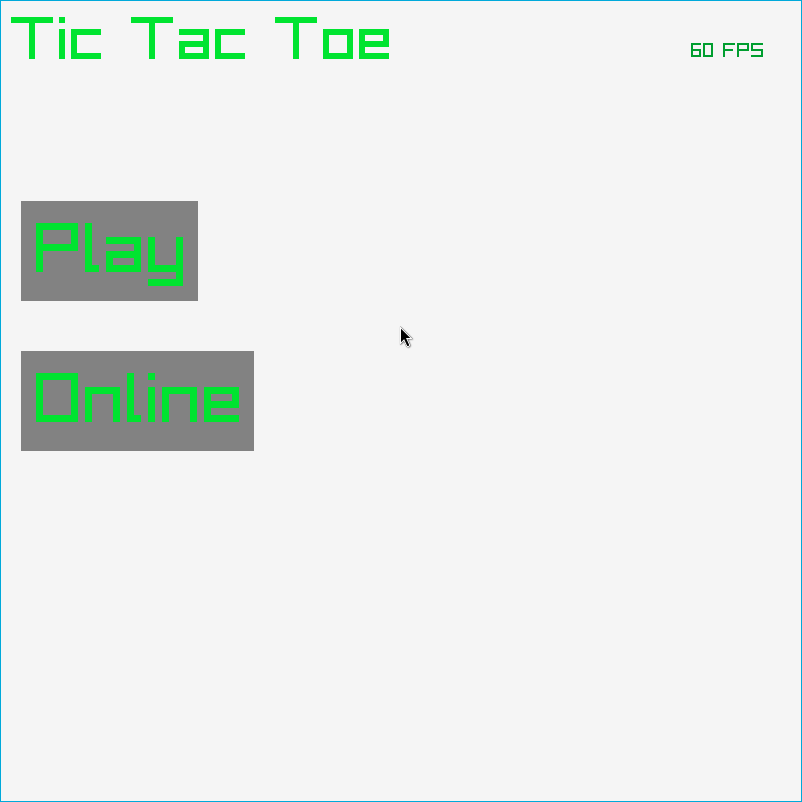
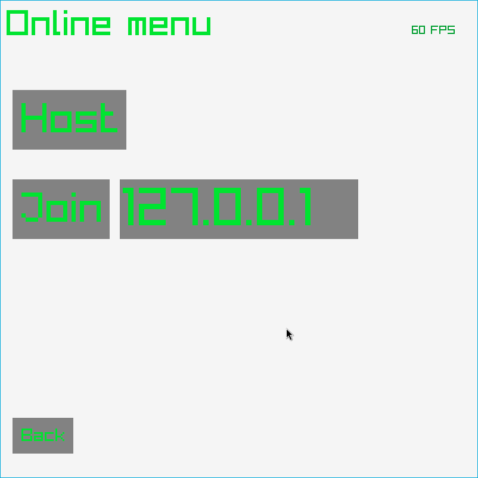
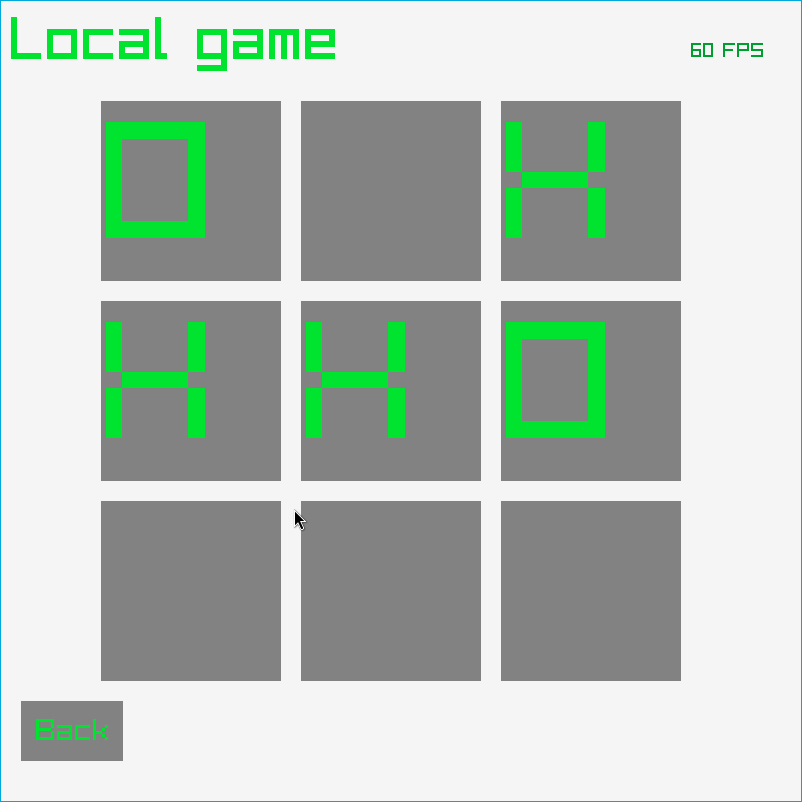
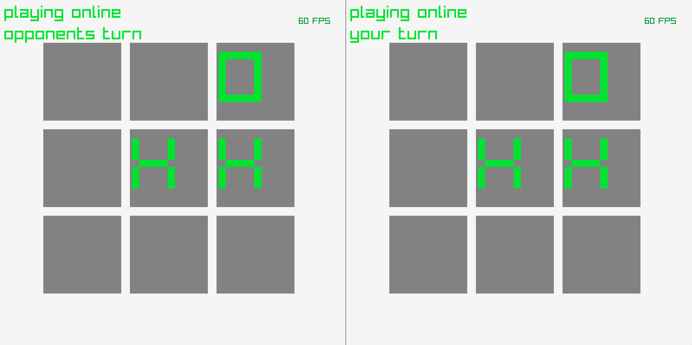

# Online tictactoe

This is an online tictactoe game that i wrote as a practice
to get better at sockets and network program in general.
Some improvents that i could make would be to make the main.c
file a lot more clearer with less if and switch statements by breaking
up the functionality into functions.

## Images

## Known issues

* If a local game is left in the middle of the game it will transfer the
board to an online game.

* the window is not closed properly in an online match while 
waiting for oppenents move.

* sometimes the connection is just left hanging
